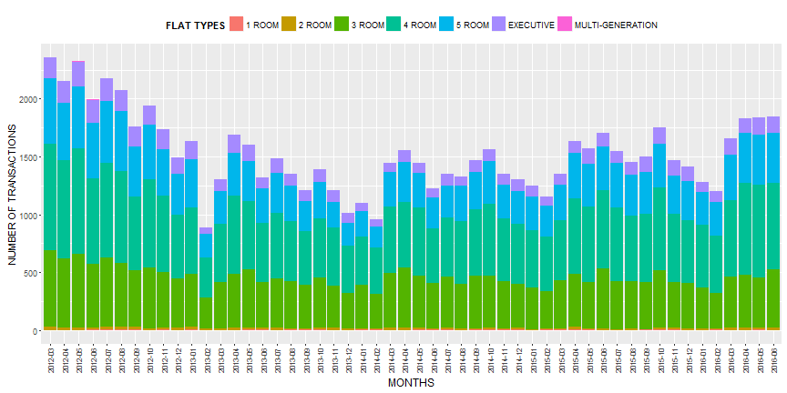
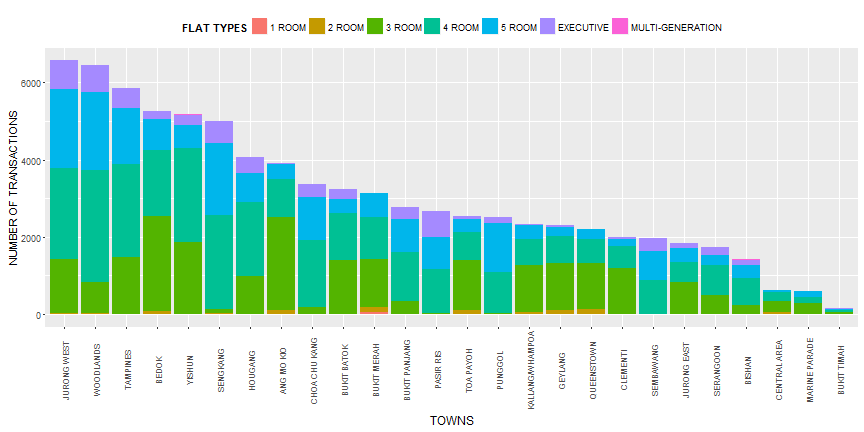
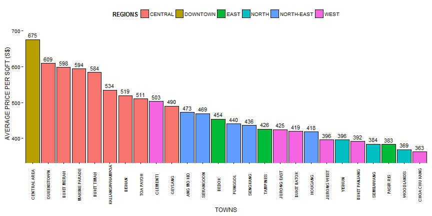

### Singapore Public Housing Resale Prices
  
   
  
by Chan Chee-Foong  
 
on 4 Aug 2016  
 
for Developing Data Products Assignment  
 
of the Data Science Specialisation  
 
by Johns Hopkins University  

--- .class #id 

## Exploratory Data Analysis

1. Data (Resale Flat Prices) is downloaded directly from http://data.gov.sg.
2. The public housing resale transacted prices are provided by Housing 
Development Board in Singapore.
3. This analysis uses all available data in the downloaded data size.  The towns are further classified into regions based on information found on this [website here] (https://data.gov.sg/dataset/master-plan-2014-planning-area-boundary-no-sea).
4. A more interactive application (ShinyApps) developed to explore the data can be found 
[here] (https://edgetrader.shinyapps.io/DevelopingDataProductsAssignment/).
5. All the charts provided in this presentation are generated using R ggplot emebedded in this slidify document.

--- .class #id 

### Total Number of Monthly Sales

Lowest number of transaction recorded on Feb 2013 due to government cooling measures on 12 Jan 2013.

--- .class #id 

### Total of Sales Transactions by Town

Top 3 towns having the most sales transactions:  
Jurong West, Woodlands and Tampines

--- .class #id 

### Price per sqft in various regions and towns

Most expensive public housing flats are found in towns close to city centre.

